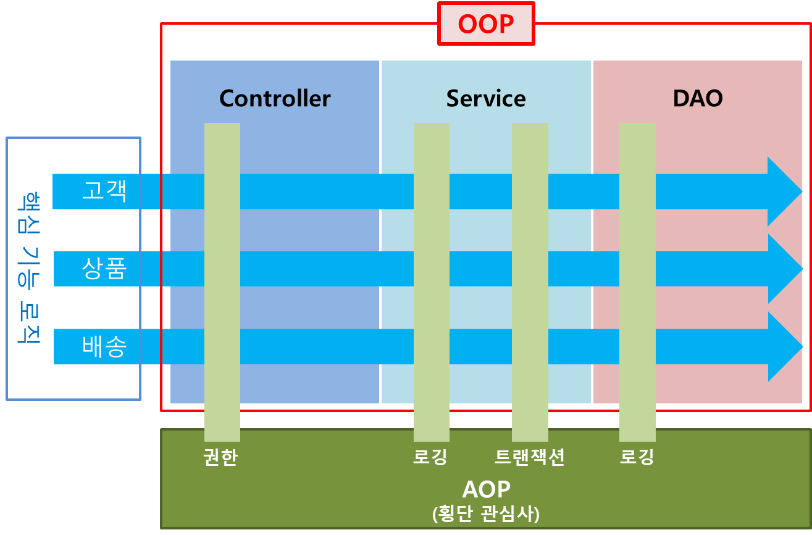
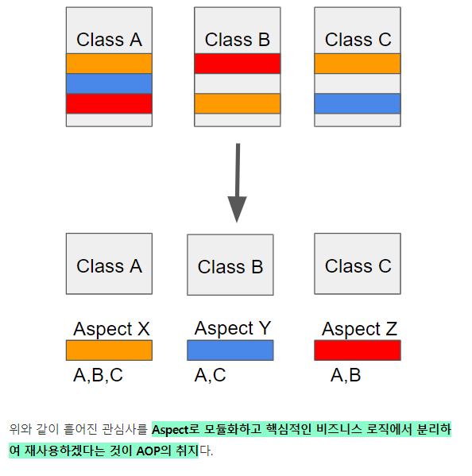
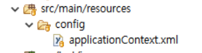
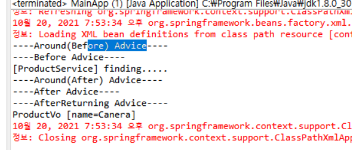

## 로깅

- 비 기능적 요구사항 ( Non Functional Requirement )
- 하지만, 프로그램 개발 중 디버깅 및 개발완료 후 문제점 추적 및 분석을 위해 필수적으로 갖추어야 할 요구 조건

- Log4J, SLF4J 가 있지만 SLF4J가 장점이 많다
- SLF4J ( Simple Logging Façade )
  - Logback( SLF4J의 구현체 중 하나)

1. Log4J 보다 속도와 메모리 사용량이 개선

2. XML & Groovy 설정 지원 ( 자동 리로딩 기능 )

3. 다양한 Appender ( console, file, socket, JDBC )

4. Rolling & Archiving ( 자동 압축 )

5. HTTP 디버깅 ( logback-access 컴포넌트


#### logex프로젝트 실습

> LogBack 라이브러리 추가

pom.xml에 추가

**1) 버전정보**

```
   	<properties>
  		<org.springframework-version>4.3.4.RELEASE</org.springframework-version>
  		<jcloverslf4j.version>1.7.6</jcloverslf4j.version>
		<logback.version>1.1.1</logback.version>
 	</properties>
```

**2) SLF4J 기반의 Logback 라이브러리를 로거로 사용할 것이기 때문에 JCL은 제외**

**시킨다.**

```
  		<!-- Spring Context(Container) -->
  		<dependency>
			<groupId>org.springframework</groupId>
			<artifactId>spring-context</artifactId>
			<version>${org.springframework-version}</version>
			<!-- JCL제외 -->			
			<exclusions>
				<exclusion>
				<groupId>commons-logging</groupId>
				<artifactId>commons-logging</artifactId>
				</exclusion>
			</exclusions>			
		</dependency>
```

**3) JCL-over-SLF4J 라이브러리 추가: JCL를 제외 시켰기 때문에 기존 Commons Logging 을 통해 로그를 남기는 코드들은 에러를 발생 시킨다. 이를 이어 주어야 하는 다리 또는 일종의 어댑터가 필요하다.**

```
		<!-- logback(slf4j) -->
		<dependency>
			<groupId>org.slf4j</groupId>
			<artifactId>jcl-over-slf4j</artifactId>
			<version>${jcloverslf4j.version}</version>
		</dependency>	
		<dependency>
			<groupId>ch.qos.logback</groupId>
			<artifactId>logback-classic</artifactId>
			<version>${logback.version}</version>
		</dependency>
```


**src/main/resources/logback.xml -> LogBack설정**

```
<?xml version="1.0" encoding="UTF-8"?>
<configuration>

	<appender name="consoleAppender" class="ch.qos.logback.core.ConsoleAppender">
		<encoder>
			<charset>UTF-8</charset>
			<Pattern>
				%d{HH:mm:ss.SSS} [%thread] %-5level %logger{5} - %msg%n
			</Pattern>
		</encoder>
	</appender>

	<appender name="fileAppender2" class="ch.qos.logback.core.rolling.RollingFileAppender">
		<file>/logex/logex2.log</file>
		<encoder class="ch.qos.logback.classic.encoder.PatternLayoutEncoder">
			<Pattern>
				%d{HH:mm:ss.SSS} [%thread] %-5level %logger{5} - %msg%n
			</Pattern>
		</encoder>
		<rollingPolicy class="ch.qos.logback.core.rolling.FixedWindowRollingPolicy">
			<FileNamePattern>/logex/logex2.%i.log.zip</FileNamePattern>
			<MinIndex>1</MinIndex>
			<MaxIndex>10</MaxIndex>
		</rollingPolicy>
		<triggeringPolicy
			class="ch.qos.logback.core.rolling.SizeBasedTriggeringPolicy">
			<MaxFileSize>50KB</MaxFileSize>
		</triggeringPolicy>
	</appender>
	
	<appender name="fileAppender3" class="ch.qos.logback.core.rolling.RollingFileAppender">
		<file>/logex/logex3.log</file>
		<encoder class="ch.qos.logback.classic.encoder.PatternLayoutEncoder">
			<Pattern>
				%d{HH:mm:ss.SSS} [%thread] %-5level %logger{5} - %msg%n
			</Pattern>
		</encoder>
		<rollingPolicy class="ch.qos.logback.core.rolling.FixedWindowRollingPolicy">
			<FileNamePattern>/logex/logex3.%i.log.zip</FileNamePattern>
			<MinIndex>1</MinIndex>
			<MaxIndex>10</MaxIndex>
		</rollingPolicy>
		<triggeringPolicy
			class="ch.qos.logback.core.rolling.SizeBasedTriggeringPolicy">
			<MaxFileSize>10KB</MaxFileSize>
		</triggeringPolicy>
	</appender>	


	<!--
		com.douzone.logex2 아래 패키지 로그들만  \logex\logex2.log 파일에만  출력하는 로거
	-->
	<logger name="com.douzone.logex2" level="debug" additivity="false">
            <appender-ref ref="fileAppender2" />
    </logger>
    
	<!--
		com.douzone.logex3 아래 패키지 로그들만  \logex\logex3.log 파일과 콘솔로 출력하는 로거
	-->
	<logger name="com.douzone.logex3"  level="warn" additivity="false">
            <appender-ref ref="fileAppender3" />
			<appender-ref ref="consoleAppender" />
    </logger>    
	
	<!-- 루트(글로벌) 로거 -->
	<root level="debug">
		<appender-ref ref="consoleAppender" />
	</root>

</configuration>
```

com.douzone.logex3.controller/ExampleController.java

```
package com.douzone.logex3.controller;

import org.apache.commons.logging.Log;
import org.apache.commons.logging.LogFactory;
import org.springframework.stereotype.Controller;
import org.springframework.web.bind.annotation.RequestMapping;
import org.springframework.web.bind.annotation.ResponseBody;

@Controller
public class ExampleController3 {
	
	/**
	 *  Logger 생성
	 */
	private static final Log LOG = LogFactory.getLog( ExampleController3.class );
	
	@RequestMapping( "/ex3" )
	@ResponseBody
	public String ex2() {
		
		/**
		 *  이 예제에서는 logback.xml 에서,
		 *  
		 *  1. fileAppender3 와 "com.douzon.logex3" logger 를 살펴 보아야 합니다.
		 *  
		 *  2. fileAppender3 에서는 /logexample/logex3.log 로그파일 지정과
		 *  
		 *  3. 1MB 가 넘었을 때, /logexample/logex3.x.log.zip 으로 압축되고 새로 
		 *     logex3.log 파일이 생성되는 것을 확인해 봐야 합니다.
		 *    
		 *  4. 새로운 로거를 세팅하고 있습니다.
		 *     "com.douzone.logex3" 로거인데, 콘솔과 파일로 로그를 남기고 있는 것을 확인해야
		 *     합니다.
		 *     
		 *  5. 이 로거의 로그 레벨이 WARN 인 것도 로그 파일에서 확인해 보세요.   
		 */
		LOG.debug( "#ex3 - debug log" );
		LOG.info( "#ex3 - info log" );
		LOG.warn( "#ex3 - warn log" );
		LOG.error( "#ex3 - error log" );
		
		return "Logback Logging Example3";
	}
}
```


[](https://engkimbs.tistory.com/746)

# 관점 지향 프로그래밍(Aspect Oriented Programming, AOP)



**AOP는 관점 지향 프로그래밍으로 어떤 로직을 기준으로 핵심적인 관점, 부가적인 관점으로 나누어서 보고 그 관점을 기준으로 각각 모듈화하는 것이다.**

• OOP를 보완하는 수단

- 기존 OOP에서 기능 별로 클래스를 분리했음에도, 여전히 공통적으로 반복되는 코드가 발생하는 단점 해결

- 공통 기능과 핵심 기능 구현 분리하는 것이 핵심

- 개발 코드에서 비즈니스 로직에 집중하도록 함



### [AOP 용어]

1. 타겟(Target)

• 부가기능을 부여할 대상을 얘기


2. 애스펙트(Aspect)

• 객체지향 모듈을 오브젝트라 부르는 것과 비슷하게 부가기능 모듈을 애스펙트라고 부르며, 핵심기능에 부가되어 의미를 갖는 특별한 모듈

• 부가될 기능을 정의한 어드바이스(Advice)와 어드바이스를 어디에 적용할지를 결정하는 포인트컷(PointCut)을 갖고 있음


3. 어드바이스 (Advice)

• 실질적으로 부가기능을 담은 구현체

• 타겟 오브젝트에 종속되지 않기 때문에 순수하	게 부가기능에만 집중할 수 있다.

•  어드바이스는 애스펙트(Aspect)가 '무엇'을 '언	제'할지를 정의한다.


4. 포인트컷 ( PointCut )

• 부가기능이 적용될 대상(메소드)를 선정하는 방법

•  즉, 어드바이스를 적용할 조인포인트(JoinPoint)를 선별하는 기능을 정의한 모듈


5. 조인포인트 ( JoinPoint )

• 어드바이스(Advice)가 적용될 수 있는 위치

• 다른 AOP 프레임워크와 달리 Spring 에서는 메소드 조인포인트(JoinPoint)만 제공

•  따라서, 스프링에서는 조인포인트(JoinPoint)라하면 메소드라 생각해도 무방


6. 프록시 ( Proxy)

•  타겟을 감싸서 타겟의 요청을 대신 받아주는 랩핑(Wrapping) 오브젝트

• 호출자(Client)에서 타겟을 호출하게 되면 타겟이 아닌 타겟을 감싸고 있는 프록시가 호출되어,

• 타겟 메소드 실행 전에 선처리, 타겟 메소드 실행 후, 후처리를 실행시키도록 구성


7. 인트로덕션 ( Introduction )

• 타겟 클래스에 코드 변경 없이 신규 메소드나 멤버변수를 추가하는 기능


8. 위빙 ( Weaving )

• 지정된 객체에 애스펙트(Aspect)를 적용해서 새로운 프록시 객체를 생성하는 과정

​	예를들어, A라는 객체에 트랜잭션 애스펙트가 지저오디어 있다면, 

​	A라는 객체가 실행되기 전 커넥션을 오픈하고 실행이 끝나면 커넥션을 종료하는 기능이 추가된 프록시 객체가 생성되고, 

​	이 프록시 객체가 앞으로 A 객체가 호출되는 시점에서 사용, 이 때의 프록시 객체가 생성되는 과정을 위빙이라고 한다.

• 컴파일 타임, 클래스로드 타임, 런타임과 같은 시점에서 실행되지만, Spring AOP는 런타임에서 프록시 객체가 생성


#### aoptest프로젝트 실습

pom.xml에 삽입

```
<!-- spring aspect -->
<dependency>
    <groupId>org.springframework</groupId>
    <artifactId>spring-aspects</artifactId>
    <version>${org.springframework-version}</version>
</dependency>
```


applicationContext.xml



```
<?xml version="1.0" encoding="UTF-8"?>
<beans xmlns="http://www.springframework.org/schema/beans"
	xmlns:xsi="http://www.w3.org/2001/XMLSchema-instance"
	xmlns:aop="http://www.springframework.org/schema/aop"
	xmlns:context="http://www.springframework.org/schema/context"
	xsi:schemaLocation="http://www.springframework.org/schema/beans
		http://www.springframework.org/schema/beans/spring-beans.xsd
		http://www.springframework.org/schema/aop http://www.springframework.org/schema/aop/spring-aop.xsd
		http://www.springframework.org/schema/context
		http://www.springframework.org/schema/context/spring-context.xsd
		http://www.springframework.org/schema/jee http://www.springframework.org/schema/jee/spring-jee.xsd
		http://www.springframework.org/schema/lang http://www.springframework.org/schema/lang/spring-lang.xsd
		http://www.springframework.org/schema/tx http://www.springframework.org/schema/tx/spring-tx.xsd
		http://www.springframework.org/schema/util http://www.springframework.org/schema/util/spring-util.xsd
		http://www.springframework.org/schema/task http://www.springframework.org/schema/task/spring-task.xsd">
	
	<!-- auto proxy -->
	<aop:aspectj-autoproxy />

	<context:annotation-config />
	<context:component-scan base-package="com.douzone.aoptest.service,com.douzone.aoptest.aspect">
		<context:include-filter type="annotation" expression="org.springframework.stereotype.Repository" />
		<context:include-filter type="annotation" expression="org.springframework.stereotype.Service" />
		<context:include-filter type="annotation" expression="org.springframework.stereotype.Component" />
	</context:component-scan>

</beans>
```

ProductService.java

```
@Service

public class ProductService {

public ProductVo findProduct( String name ) {

System.out.println( "finding " + name + "..." );

return new ProductVo( name );

	}
}
```

ProductVo.java

```
public class ProductVo {

private String name;

public ProductVo( String name ) {

this.name = name;

}

public String getName() {

return name;

}

public void setName(String name) {

this.name = name;

}

@Override

public String toString() {

return "ProductVo [name=" + name + "]";

}

}
```

App.java

```
public class App {

public static void main( String[] args ){

ApplicationContext applicationContext =

new ClassPathXmlApplicationContext( "config/applicationContext.xml" );

ProductService productService =

(ProductService)applicationContext.getBean( "productService" );

productService.findProduct( "TV" );

}

}
```


**자주 사용되는 pointCut**

```
("execution(* *..*.ProductService.*(..))")
```

execution(접근자	반환타입	패키지.클래스(인터페이스).메소드(인수) throw 예외)


MyAspect.java

```
package com.douzone.aoptest.aspect;

import org.aspectj.lang.ProceedingJoinPoint;
import org.aspectj.lang.annotation.After;
import org.aspectj.lang.annotation.AfterReturning;
import org.aspectj.lang.annotation.AfterThrowing;
import org.aspectj.lang.annotation.Around;
import org.aspectj.lang.annotation.Aspect;
import org.aspectj.lang.annotation.Before;
import org.springframework.stereotype.Component;

@Aspect
@Component
//@Aspect로 이 클래스가 Aspect를 나타내는 클래스라는 것을 명시하고
//@Component로 스프링 빈으로 등록한다.
public class MyAspect {
	
	@Before("execution(public com.douzone.aoptest.vo.ProductVo com.douzone.aoptest.service.ProductService.find(String))")
	public void beforeAdvice() {
		System.out.println("----Before Advice----");
	}
	
	
	@After("execution(* *..*.ProductService.*(..))")
	public void afterAdvice() {
		System.out.println("----After Advice----");
	}
	
	@AfterReturning("execution(* *..*.ProductService.*(..))")
	public void afterReturningAdvice() {
		System.out.println("----AfterReturning Advice----");
	}
	
	@AfterThrowing(value="execution(* *..*.ProductService.*(..))",throwing="ex")
	public void afterThrowingAdvice(Throwable ex) {
		System.out.println("----afterThrowing Advice: " + ex +"----");
	}
	
	@Around("execution(* *..*.ProductService.*(..))")
	public Object aroundAdvice(ProceedingJoinPoint pjp) throws Throwable{
		//before
		System.out.println("----Around(Before) Advice----");
		
		//PointCut Method실행
		//Object result = pjp.proceed();
		
		
		//파라미터 가로채기
		Object[] params = {"Canera"};		
		Object result = pjp.proceed(params);
		
		//after
		System.out.println("----Around(After) Advice----");
		
		return result;
	}
}

```

@Before: 메소드 시작시점에 동작하는 어드바이스

@After: 메소드 종료 시점에 호출

@AfterReturning: 메소드 호출이 에외를 보내지 않고 정상 종료 했을때 동작하는 어드바이스

**@Around: 메소드 호출 전후에 동작하는 어드바이스**

@AfterThrowing: 대상 객체의 메서드를 실행하는 도중 예외가 발생한 경우에 공통 기능을 실행




#### 모든 DAO의 실행시간을 log로 남기는 Aspect.java 실습

MeasureExecutionTimeAspect.java

```
package com.douzone.mysite.aspect;

import org.aspectj.lang.ProceedingJoinPoint;
import org.aspectj.lang.annotation.Around;
import org.aspectj.lang.annotation.Aspect;
import org.springframework.stereotype.Component;
import org.springframework.util.StopWatch;

@Aspect
@Component
public class MeasureExecutionTimeAspect {
	
	@Around("execution(* *..*.repository.*.*(..)) || execution(* *..*.service.*.*(..))")
	public Object aroundAdvice(ProceedingJoinPoint pjp) throws Throwable{
		
		//before
		StopWatch sw = new StopWatch();
		sw.start();
		
		Object result = pjp.proceed();

		
		//after
		sw.stop();
		Long totaltime = sw.getTotalTimeMillis();
		
		String className = pjp.getTarget().getClass().getName();
		String methodName = pjp.getSignature().getName();
		String taskName = className + "." + methodName;
		
		System.out.println("[Execution Time][" + taskName + "]" + totaltime );
		
		return result;
	}
}
```

어드바이스가 타켓메소드(Object result = pjp.proceed();)를 감싸서 타겟 메소드 호출전과 후에 어드바이스 기능을 수행
