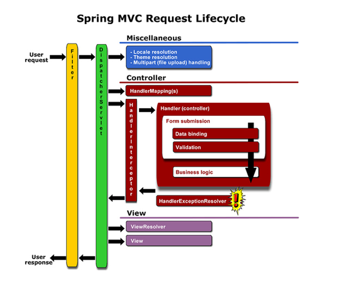
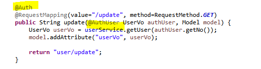

## Interceptor

- 컨트롤러에 들어오는 요청 **HttpRequest**와 컨트롤러가 응답하는 **HttpResponse**를 가로채는 역할을 합니다.
- 인터셉터는 관리자만 접근할 수 있는 관리자 페이지에 접근하기 전에 관리자 인증을 하는 용도로 활용될 수 있습니다.




**Filter와 Interceptor의 차이**

**1. 호출 시점**

Filter는 DispatcherServlet이 실행되기 전 , Interceptor는 DispatcherServlet이 실행된 후

**2. 설정 위치**

Filter는 web.xml , Interceptor는 spring-servlet.xml

**3. 구현 방식**

Filter는 web.xml에서 설정을 하면 구현이 가능하지만, Interceptor는 설정은 물론 메서드 구현이 필요합니다.


**Interceptor 예제실습**

MyInterceptor01

```
public class MyInterceptor01 implements HandlerInterceptor {

	@Override
	public boolean preHandle(HttpServletRequest request, HttpServletResponse response, Object handler)
			throws Exception {
		System.out.println("MyInterceptor01.preHandle() called");
		return true;
	}

	@Override
	public void postHandle(HttpServletRequest request, HttpServletResponse response, Object handler,
			ModelAndView modelAndView) throws Exception {
		System.out.println("MyInterceptor01.postHandle() called");
	}

	@Override
	public void afterCompletion(HttpServletRequest request, HttpServletResponse response, Object handler, Exception ex)
			throws Exception {
		System.out.println("MyInterceptor01.afterCompletion() called");
	}

}

```

- preHandle(): 컨트롤러가 호출되기 전에 실행, 반환값이 true이면 실행, false이면 중단하고 남은 인터셉터와 컨트롤러가 실행되지 않는다.
- postHandle(): 컨트롤러가 실행된 후에 호출된다.
- afterComplete(): 뷰에서 최종결과가 생성하는 일을 포함한 모든 일이 완료 되었을 때 실행된다.


MyInterceptor02

```
public class MyInterceptor02 extends HandlerInterceptorAdapter{

	@Override
	public boolean preHandle(HttpServletRequest request, HttpServletResponse response, Object handler)
			throws Exception {
		// TODO Auto-generated method stub
		System.out.println("MyInterceptor02.preHandle()");
		return super.preHandle(request, response, handler);
	}

}
```


spring-servlet.xml(등록)

```
	<mvc:interceptors>
		<mvc:interceptor>
			<mvc:mapping path="/board/**" />
			<bean class="com.douzone.hellospring.interceptor.MyInterceptor01" />
		</mvc:interceptor>
		
				<mvc:interceptor>
			<mvc:mapping path="/guestbook/**" />
			<bean class="com.douzone.hellospring.interceptor.MyInterceptor02" />
		</mvc:interceptor>
	</mvc:interceptors>
```

- 매핑URL에 들어갈때 모든 요청을 가로채서( Interceptor ) com.victolee.interceptor 패키지에 있는 MyInterceptor 객체를 실행하겠다는 의미입니다.


## @Auth - 접근 권한

-  클라이언트가 로그인된 회원인지 아닌지, 그리고 일반 회원인지 관리자인지 구분할 용도인 어노테이션입니다.


Auth.java

```
@Target({ElementType.METHOD, ElementType.TYPE})
@Retention(RetentionPolicy.RUNTIME)
public @interface Auth {
	// public String value() default "USER";
	public String role() default "USER";
	
}
```

- **@Retention**:  세션을 처리하기 위한 어노테이션이므로, 실행 시에 동작을 해야합니다.
- **@Target**:  세션을 처리하기 위해 사용할 타입을 선택합니다.(메소드, 클래스(TYPE))

- **접근 권한이 필요한 메서드 위에 @Auth 어노테이션을 작성하면 접근 권한이 있는 사용자인지 아닌지 판별할 수 있습니다.**

AuthInterceptor.java

```
package com.douzone.mysite.security;

import javax.servlet.http.HttpServletRequest;
import javax.servlet.http.HttpServletResponse;
import javax.servlet.http.HttpSession;

import org.springframework.web.method.HandlerMethod;
import org.springframework.web.servlet.handler.HandlerInterceptorAdapter;

import com.douzone.mysite.vo.UserVo;

public class AuthInterceptor extends HandlerInterceptorAdapter {

	@Override
	public boolean preHandle(
			HttpServletRequest request, 
			HttpServletResponse response, 
			Object handler)
			throws Exception {
		
		//1. handler 종류 확인
		if(handler instanceof HandlerMethod == false) {
			return true;
		}
		
		//2. casting
		HandlerMethod handlerMethod = (HandlerMethod)handler;
		
		//3. Handler Method의 @Auth 받아오기
		Auth auth = handlerMethod.getMethodAnnotation(Auth.class);
		
		//4. Handler Method에 @Auth가 없으면 Type에 있는 지 확인(과제)
		if(auth == null) {
			auth = handlerMethod.getMethod().getDeclaringClass().getAnnotation(Auth.class);
		}
		
		//5. Type과 Method에 @Auth가 적용이 안되어 있는 경우
		if(auth == null) {
			return true;
		}
		
		//6. @Auth가 적용이 되어 있기 때문에 인증(Authenfication) 여부 확인
		HttpSession session = request.getSession();
		if(session == null) {
			response.sendRedirect(request.getContextPath() + "/user/login");
			return false;
		}
		UserVo authUser = (UserVo)session.getAttribute("authUser");
		if(authUser == null) {
			response.sendRedirect(request.getContextPath() + "/user/login");
			return false;
		}
		
		//7. 권한(Authorization) 체크를 위해서 @Auth의 role 가져오기("USER", "ADMIN")
		String role = auth.role();
		
		//8. @Auth의 role이 "USER" 인 경우, authUser의 role은 상관없다.
		if("USER".equals(role)) {
			return true;
		}
		
		//9.@Auth의 role이 "ADMIN" 인 경우, authUser의 role은 "ADMIN" 이어야 한다.
		if("ADMIN".equals(authUser.getRole()) == false) {
			response.sendRedirect(request.getContextPath());
			return false;
		}
		
		// 옳은 관리자 권한
		// @Auth의 role: "ADMIN"
		// authUser의 role: "ADMIN"
		return true;
	}
}
```


springservlet.xml 등록

```
		<mvc:interceptor>
			<!-- 모든 경로에 대해 @Auth 어노테이션이 실행되도록 한다. -->
			<mvc:mapping path="/**"/>
			<!-- /user/login은 또 다른 interceptor가 처리한다.
			 즉 컨트롤러에 매핑되어 있는 것이 아니므로 제외시킨다. -->
			<mvc:exclude-mapping path="/user/auth"/>
			<!-- /user/logout은 또 다른 interceptor가 처리한다.
			 즉 컨트롤러에 매핑되어 있는 것이 아니므로 제외시킨다. -->
			<mvc:exclude-mapping path="/user/logout"/>
			<!-- defaultServlet이 처리하는 경로는 제외 -->
			<mvc:exclude-mapping path="/assets/**"/>
			<bean class="com.douzone.mysite.security.AuthInterceptor" />
		</mvc:interceptor>
```


## @AuthUser 

- 세션 처리를 하는 방법


@AuthUser 어노테이션

```
import static java.lang.annotation.ElementType.PARAMETER;
import static java.lang.annotation.RetentionPolicy.RUNTIME;

import java.lang.annotation.Retention;
import java.lang.annotation.Target;

@Retention(RUNTIME)
@Target(PARAMETER)
public @interface AuthUser {

}
```

- @Target(PARAMETER): 메서드 파라미터에 작성 할 어노테이션


AuthUserHandlerMethodArgumentResolver.java

```
package com.douzone.mysite.security;

import javax.servlet.http.HttpServletRequest;
import javax.servlet.http.HttpSession;

import org.springframework.core.MethodParameter;
import org.springframework.web.bind.support.WebArgumentResolver;
import org.springframework.web.bind.support.WebDataBinderFactory;
import org.springframework.web.context.request.NativeWebRequest;
import org.springframework.web.method.support.HandlerMethodArgumentResolver;
import org.springframework.web.method.support.ModelAndViewContainer;

import com.douzone.mysite.vo.UserVo;

public class AuthUserHandlerMethodArgumentResolver implements HandlerMethodArgumentResolver {

	@Override
	public Object resolveArgument(MethodParameter parameter, 
			ModelAndViewContainer mavContainer,
			NativeWebRequest webRequest, 
			WebDataBinderFactory binderFactory) throws Exception {
		
		//1. 파라미터에 @AuthUser가 붙어있는지, 타입이 UserVo인지 확인
		if(!supportsParameter(parameter)) {
			return WebArgumentResolver.UNRESOLVED;
		}
		
		HttpServletRequest request = (HttpServletRequest) webRequest.getNativeRequest();
		HttpSession session = request.getSession();
		
		if(session == null) {
			return null;
		}
		
		return session.getAttribute("authUser");
	}
	
	@Override
	public boolean supportsParameter(MethodParameter parameter) {
		
		//2. @AuthUser가 붙어 있는지 확인
		AuthUser authUser = parameter.getParameterAnnotation(AuthUser.class);
		
		//@AuthUser가 안붙어있음
		if(authUser == null) {
			return false;
		}
		
		//파라미터 타입이 UserVo가 아님
		if(parameter.getParameterType().equals(UserVo.class) == false) {
			return false;
		}
		
		
		
		
		
		return true;
	}

}
```

- 컨트롤러의 매개변수에 @AuthUser 어노테이션이 있는지 확인하고, 매개변수의 타입이 UserVO 인지 확인한 후, HttpSession 객체를 이용하여 세션 객체를 반환합니다.


springservlet.xml 에 부착

```
	<mvc:annotation-driven>
		<mvc:argument-resolvers>
			<bean class="com.douzone.mysite.security.AuthUserHandlerMethodArgumentResolver" />
		</mvc:argument-resolvers>
	</mvc:annotation-driven>
```


사용 예




