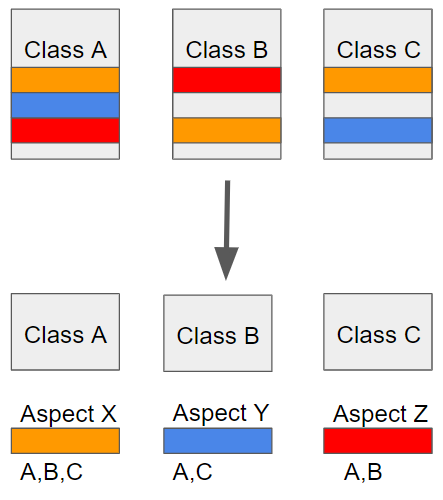
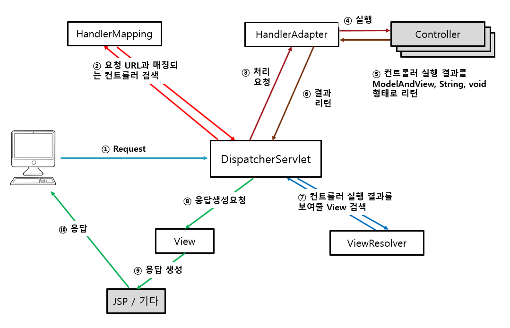
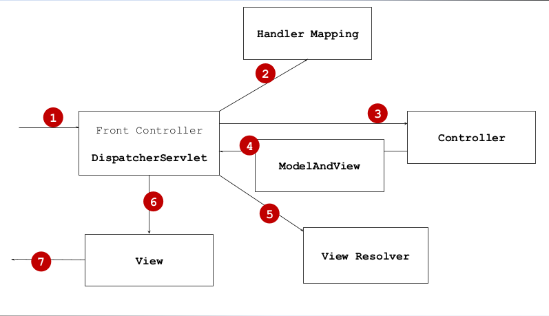

# Spring 시작하기

## 1. Spring

### What is Spring?

자바 엔터프라이즈 개발을 편하게 해주는 오픈소스 경량급 애플리케이션 **프레임워크**

JAVA Application Framework

자바 어플리케이션의 클래스나 객체 등의 구성을 관리해주는 **컨테이너**

### 라이브러리

전체적인 흐름 제어를 위해 어플리케이션 기능들에 필요한 재활용이 가능한 코드

### 프레임워크

프레임워크는 수많은 라이브러리로 이루어 졌다고 할 수 있다

소프트웨어를 만드는 데 기본이 되는 **골격 코드**

골격 코드이기 때문에 완전한 어플리케이션이 아니다 (= 반제품)

사용자는 이 골격 코드의 틀에 맞춰서 개발을 진행해야한다

기능 구현에 필요한 문제 영역을 해결하기 위해 잘 설계된 **재사용이 가능한 모듈**

### Spring 컨테이너

Spring 프레임워크는 컨테이너라고도 한다(DI 컨테이너)

Spring 컨테이너는 자바 객체의 생명 주기를 관리하며, 생성된 자바 객체들에게 추가적인 기능을 제공하는 역할을 한다

여기서 말하는 자바 객체(Object)를 Spring에서는 빈(Bean)이라고 부른다

Spring은 빈을 생성하는 공장이다 (=Bean Factory)

Mybatis, Spring MVC, Spring Dao와 같은 프레임워크의 각 클래스들은 Spring 컨테이너에서 관리된다

### Spring 프레임워크 구성요소

### 종류

- Spring AOP
  
    AOP는 Aspect Oriented Programming의 약자로 **관점 지향 프로그래밍이다**
    
    관점 지향은 어떤 로직을 기준으로 핵심적인 관점, 부가적인 관점으로 나누어서 보고 
    
    그 관점을 기준으로 각각 모듈화 하겠다는 것이다
    
    AOP는 OOP의 단점을 보완하기 위한 방법
    
    
    
- Spring ORM
  
    ORM (Object-relational mapping : 객체 관계 매핑)
    
    자바 객체와 데이터베이스 테이블간의 매핑 처리한다
    
    객체는 객체대로 설계하고 관계형 데이터베이스는 관계형 데이터베이스대로 설계한다
    
    ORM 프레임워크가 중간에서 매핑해주므로 데이터 생성, 데이터 조작 및 데이터 접근을 단순화 한다
    
- Spring DAO
  
    MyBatis 프레임워크(DB 관련 담당)를 이용하지 않고 Spring자체적으로 DB를 이용할 수 있도록 지원
    
    Spring DAO를 이용할 경우 지금까지 개발하던 DAO보다 적은 코드와 쉬운 방법으로 DAO를 개발하는 것이 가능
    
- Spring Web

- Spring Context
  
    xml 파일 읽어오며 객체 생성을 담당
    
- Spring Web MVC
  
    Spring 프레임워크에서 독립적으로 Web UI Layer에 Model-View-Controller를 지원하기 위한 기능
    
- Spring Core
  
    Spring 프레임워크의 근간이 되는요소. IoC(또는 DI) 기능을 지원하는 영역을 담당.
    
    BeanFactory를 기반으로 Bean 클래스들을 제어할 수 있는 기능을 지원


## 1.1 DispatcherServlet 과 MVC





**1.사용자의 요청을 DispatcherServlet이 받는다.**

**2.요청을 처리해야 하는 컨트롤을 찾기 위해 **HandlerMapping**에게 질의를 하고 **HandlerMapping**은 컨트롤 객체에 매핑되어 있는 URL를 찾아낸다.**

**3, 4. **DispatcherServlet**은 찾은 컨트롤에게 요청을 전달하고 Controller는 서비스 계층의 인터페이스를 호출하여 적절한 비지니스를 수행한다.**

**5, 6. 컨트롤러는 비지니스 로직의 수행결과로 받아낸 도메인 모델 객체와 함께 뷰이름을 ModelAndView 객체에 저장하여 반환한다.**

**7. DispatcherServlet은 응답할 View를 찾기 위해 ViewResolver 에게 질의를 한다.**

**8.DispatcherServlet은 찾아낸 View 객체에게 요청을 전달한다.**


### 2. POJO

P(lain) O(ld) J(ava) O(bject)

### 스프링 프레임워크 이전에는..

원하는 엔터프라이즈 기술이 있다면 그 기술을 직접적으로 사용하는 객체를 설계

### 스프링 프레임워크 이후로는..

특정 기술과 환경에 종속되어 의존

그 결과 자바 코드의 가독성 저하 및 유지보수의 어려움이 증가

또한 특정 기술에 직접 의존하기 때문에 확장성이 매우 떨어지는 단점 존재

위와 같은 이유로 객체지향적이었던 자바가 객체지향 설계의 장점을 잃어버리게 된다

이때 등장한 개념이 POJO이다

말그대로 자바의 장점을 살리는 '오래된' 방식(옛 방식)의 '순수한' 자바 객체를 설계한다

- IoC/DI, AOP, PSA는 애플리케이션을 POJO로 개발할 수 있게 해주는 기술
- DI(Dependency Injection,  의존성 주입) , IoC(Inversion of Control, Bean, Object)
  - Inversion of Control란, 제어의 역전이라는 의미로 메소드나 객체의 호출 작업을 개발자가 결정하는 것이 아니라 <Strong>외부에서 결정</Strong>되는 것을 의미한다.

### 요약

특정 환경에 종속되지 않는다 (기술과 비즈니스 분리)

스프링에서는 스프링에 특화된 인터페이스 구현을 요구하지 않음

스프링 자체에 의존성이 높은 클래스 확장을 거의 요구 하지 않음

### POJO 프로그래밍의 장점

스프링의 정수는 엔터프라이즈 개발에서 요구하는 모든 기술을 POJO를 통해 제공

> - <Strong>AOP(Aspect Oriented Programming)</Strong>
>   - 관점 지향 프로그래밍
>
> ADao class
>
> ```java
> insert(){
>     log(); // Class A로 빼냄
>     execute(sql);
>     Exception(); // Class B로 빼냄
> }
> ```
>
> BDao class
>
> ```java
> select(){
>     log(); // Class A로 빼냄
>     execute(sql);
>     Exception(); // Class B로 빼냄
> }
> ```
>
> CDao class
>
> ```java
> update(){
>     log(); // Class A로 빼냄
>     execute(sql);
>     Exception(); // Class B로 빼냄
> }
> ```
>
> 해당 세 Dao 클래스에서 log();를 전부 Class A로 이식
>
> Class A
>
> ```java
> log();
> ```
>
> 해당 세 Dao 클래스에서 Exception();을 전부 Class B로 이식
>
> Class B
>
> ```java
> Exception();
> ```


## hellospring 웹 애플리케이션 작성 실습 예제

1. hellospring03 Maven 프로젝트 생성


2. pom.xml 디펜던시 추가

```
<!-- Spring Core Library -->
<dependency>

 <groupId>org.springframework</groupId>

 <artifactId>spring-context</artifactId>

 <version>4.2.1.RELEASE</version>

</dependency>
```

```
<!-- Spring Web Library -->

<dependency>

 <groupId>org.springframework</groupId>

 <artifactId>spring-web</artifactId>

 <version>4.2.1.RELEASE</version>

</dependency>
```

```
<!-- Spring MVC Library -->
<dependency>

 <groupId>org.springframework</groupId>

 <artifactId>spring-webmvc</artifactId>

 <version>4.2.1.RELEASE</version>

</dependency>
```


3. web.xml에 서블릿맵핑추가 

```
<!-- DispatchServlet에 대한 서블릿 매핑 추가 -_>
<servlet>

 <servlet-name>spring</servlet-name>

 <servlet-class>org.springframework.web.servlet.DispatcherServlet</servlet-class>

</servlet>

 

<servlet-mapping>

 <servlet-name>spring</servlet-name>

 <url-pattern>/</url-pattern>

</servlet-mapping>
```


3. /WEB-INF/spring-sevlet.xml 파일생성 후 컨텍스트 설정

```
<?xml version="1.0" encoding="UTF-8"?>

<beans

xmlns:xsi="http://www.w3.org/2001/XMLSchema-instance"

xmlns:aop="http://www.springframework.org/schema/aop"

xmlns="http://www.springframework.org/schema/beans"

xmlns:p="http://www.springframework.org/schema/p"

xmlns:context="http://www.springframework.org/schema/context"

xmlns:mvc="http://www.springframework.org/schema/mvc"

xsi:schemaLocation="http://www.springframework.org/schema/mvc
http://www.springframework.org/schema/mvc/spring-mvc.xsd

http://www.springframework.org/schema/aop
http://www.springframework.org/schema/aop/spring-aop.xsd

http://www.springframework.org/schema/beans
http://www.springframework.org/schema/beans/spring-beans.xsd

http://www.springframework.org/schema/context
http://www.springframework.org/schema/context/spring-context.xsd">

<context:annotation-config />

<context:component-scan base-package="com.example.springex.controller" />

</beans>
```


4. 컨트롤러 패키지 안에 HelloController 클래스 생성

### HelloController.java

```
package com.douzone.hellospring.controller;

import org.springframework.stereotype.Controller;
import org.springframework.ui.Model;
import org.springframework.web.bind.annotation.RequestMapping;
import org.springframework.web.bind.annotation.ResponseBody;
import org.springframework.web.servlet.ModelAndView;

@Controller
public class HelloController {
	
	@RequestMapping("/hello")
	public String hello() {
		return "/WEB-INF/views/hello.jsp";
	}
	
	@RequestMapping("/hello2")
	public String hello2(String name) {
		System.out.println(name);
		return "/WEB-INF/views/hello2.jsp";
	}
	
	@RequestMapping("/hello3")
	public ModelAndView hello3(String name) {
		ModelAndView mav = new ModelAndView();
		mav.addObject("name", name);
		mav.setViewName("/WEB-INF/views/hello3.jsp");
		return mav;
	}
	
	/// hello3 hello4는 같은 값이 나온다. 4가 더 깔끔한방법
	@RequestMapping("/hello4")
	public String hello4(String name, Model model) {
		model.addAttribute("name", name);
		return "/WEB-INF/views/hello3.jsp";
	}
	
	@ResponseBody
	@RequestMapping("/hello5")
	public String hello5() {
		return "<h1>Hello World</h1>";
	}
	

	@RequestMapping("/hello6")
	public String hello6() {
		System.out.println("hello6() called");
		return "redirect:/hello";
	}	
}
```


**@RequestMapping**


- 메소드 단독 매핑

@RequestMapping("/hello")


- 타입 + 메소드 매핑

  @RequestMapping( "/user" )

  public class UserController {

  

  @RequestMapping( "/add" )

  public String add( .... ) { }

  

  @RequestMapping( "/delete" )

  public String edelete( ... ) { }

  

  }

- 타입 단독 매핑

@RequestMapping( "/user/*" )

public class UserController {


@RequestMapping

public String add( .... ) {

}


@RequestMapping

public String edit( ... ) {

}


}

- 파라미터 매핑

public String view( @RequestParam( value="id", required=false, defaultValue="-1") int id ) {

. . .

}


- URL 패스 기반 파라미터 매핑

@RequestMapping( "/board/view/{no}" )

public String view( @PathVariable("no") int no ) {

. . .

}
