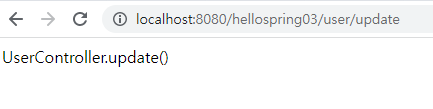
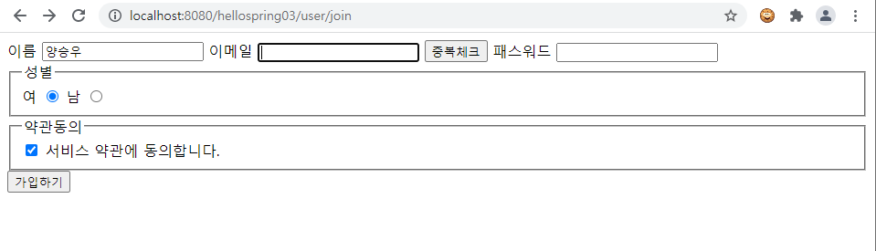
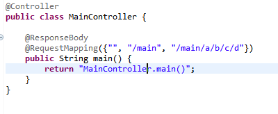
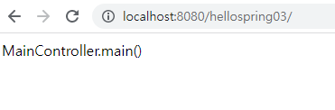
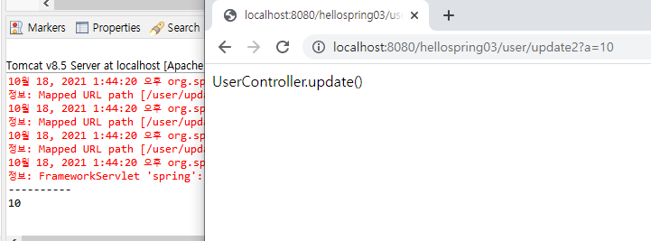

# 10.18

# Spring

## 1. Spring 기본 개념

- Spring = Spring Container = DI / IoC Container

- 흔히 스프링이라 부르지만 "**스프링 프레임워크(Spring Framework)"**라고 하는 것이 정확한 표현
- 경량 컨테이너로서 자바 객체를 직접 관리

- 자바SE로 된 자바 객체(POJO)를 자바EE에 의존적이지 않게 연결해준다.

   \- POJO(Plain Old Java Object)란 단순히 평범한 자바빈즈(Javabeans) 객체를 의미한다.


## 2.스프링 특징

### DI : Dependency Injection (의존성 주입)

객체를 직접 생성하는 게 아니라 외부에서 생성한 후 주입 시켜주는 방식

DI를 통해서 모듈 간의 결합도가 낮아지고 유연성이 높아진다

### IoC : Inversion of Contrl (제어의 역전)

메소드나 객체의 호출작업을 개발자가 결정하는 것이 아니라, 외부에서 결정되는 것을 의미

객체의 의존성을 역전시켜 객체 간의 결합도를 줄이고 유연한 코드를 작성할 수 있게 하여 가독성 및 코드 중복, 유지 보수를 편하게 할 수 있게 한다.

기존에는 다음과 순서로 객체가 만들어지고 실행되었다.

1. 객체 생성
2. 의존성 객체 생성*클래스 내부에서 생성*
3. 의존성 객체 메소드 호출

하지만, 스프링에서는 다음과 같은 순서로 객체가 만들어지고 실행된다.

1. 객체 생성
2. 의존성 객체 주입 
   
     스스로가 만드는것이 아니라 제어권을 스프링에게 위임하여 스프링이 만들어놓은 객체를 주입한다.
    
3. 의존성 객체 메소드 호출

스프링이 모든 의존성 객체를 스프링이 실행될때 다 만들어주고 필요한곳에 주입시켜줌으로써 

Bean(객체)들은 `싱글턴 패턴`의 특징을 가지며,

제어의 흐름을 사용자가 컨트롤 하는 것이 아니라 스프링에게 맡겨 작업을 처리하게 된다.

- 여기서 싱글턴 패턴이란?
  
    전역 변수를 사용하지 않고 객체를 하나만 생성 하도록 하며, 생성된 객체를 어디에서든지 참조할 수 있도록 하는 패턴


### AOP: Aspect-Oriented Programming(관점지향 프로그래밍

##### )

트랜잭션이나 로깅, 보안과 같이 여러 모듈에서 **공통적으로 사용하는 기능의 경우 해당 기능을 분리**하여 관리할 수 있다.

### 트랜잭션 관리 프레임워크

추상화된 트랜잭션 관리를 지원하며 설정파일(xml, java, property 등)을 이용한 선언적인 방식 및 프로그래밍을 통한 방식을 모두 지원한다.

### 모델 - 뷰 - 컨트롤러 패턴

- Spring MVC라 불리는 모델-뷰-컨트롤러 패턴 사용
- DispatcherServlet이 Controller역할을 담당하여 각종 요청을 적절한 서비스에 분산시켜주며 이를 각 서비스들이 처리를 하여 결과를 생성하고 그 결과는 다양한 형식의 View서비스들로 화면에 표시될 수 있다,

### 배치 프레임워크

스프링은 특정 시간대에 실행하거나 대용량의 자료를 처리하는데 쓰이는 일괄처리를 지원하는 배치 프레임워크를 제공한다.

### Annotation(어노테이션)

본래 주석이라는 뜻이다

인터페이스를 기반으로 한 문법이다

주석처럼 코드에 달아 클래스에 특별한 의미를 부여하거나 기능을 주입할 수 있다

또한 해석되는 시점을 정할 수 도 있다

### @Configuration

Configuration을 설명하기 앞서

Java Config란 말 그대로 자바 클래스 파일을 설정 파일로 사용하겠다는 뜻이다

xml 설정과 비교해서 Java Config를 사용하는 이유는, 

클래스의 경우 이클립스 같은 IDE에서 오타를 발견하기 쉽고 자동완성 등을 지원하기 때문에 관리가 편리

스프링에서는 Java Config로 사용하는 클래스에는  @Configuration 이라는 어노테이션을 붙여서 표시한다

즉,  @Configuration = Spring 설정 클래스를 선언하는 어노테이션이다

Java Config로 설정을 할 클래스 위에는 @Configuration가 붙어 있어야 한다

ApplicationContext 중에서 AnnotationConfigApplicationContext는 JavaConfig 클래스를 읽어들여

IoC와 DI를 적용하게 된다

이때 설정파일 중에  @Bean이 붙어있는 메소드들을 

AnnotationConfigApplicationContext이 자동으로 실행하여 

그 결과로 리턴하는 객체들은 기본적으로 싱글턴으로 관리를 하게 된다

### Spring 동작 순서

1. 서버로 클라이언트의 요청이 들어오면 web.xml에 지정된 servlet-mapping을 확인해서 Dispatcher 실행
2. Dispatcher Servlet(Controller)가 init( ) 함수 호출
3. ApplicationContext 컨테이너가 생성된다
   
    예시) ApplicationContext ac = new WebXmlApplicationContext(" ... 설정파일 ...");
    
    - 설정 파일 이름은 spring-servlet.xml 과 같이 임의로 만든 파일을 지정해준다
    - 우리 프로젝트에는 hellopsring03의 /WEB-INF/spring-servlet.xml 로 지정해주었다
4. spring-servlet.xml 설정 파일에서 Bean Connection + Wireing된다
5. Request일 경우 Controller에서 @RequestMapping 어노테이션으로 세팅된 메소드를 통해 
   
    controller에 들어온 요청을 처리한다
    
    Response일 경우 @ResponseBody로 처리
    
    Response는 ViewResolver 또는 MesaageConverter로 처리한다
    
6. Service
7. doGet(request, response)


**spring-초기설정.txt**

```
1. maven project 생성(war)(ex..mysite02)
2. web.xml 추가 및 설정(Java EE Tools > Generate Deployment Descriptor Stub)
3. target runtime 설정
4. pom.xml 설정
5. web.xml 설정
   1) /WEB-INF/applicationContext.xml (Root Application Context)
   2) /WEB-INF/spring-servlet.xml     (Web Application Context)
6. package
   com.douzone.mysite.controller
   com.douzone.mysite.service
   com.douzone.mysite.repository
   com.douzone.mysite.vo
7. views/*.jsp 파일 정리
8. controller, service, repository 소스 코드 작업
```


/WEB-INF/applicationContext.xml

```
<?xml version="1.0" encoding="UTF-8"?>
<beans xmlns="http://www.springframework.org/schema/beans"
	xmlns:xsi="http://www.w3.org/2001/XMLSchema-instance"
	xmlns:aop="http://www.springframework.org/schema/aop"
	xmlns:context="http://www.springframework.org/schema/context"
	xsi:schemaLocation="http://www.springframework.org/schema/beans
		http://www.springframework.org/schema/beans/spring-beans.xsd
		http://www.springframework.org/schema/aop http://www.springframework.org/schema/aop/spring-aop.xsd
		http://www.springframework.org/schema/context
		http://www.springframework.org/schema/context/spring-context.xsd
		http://www.springframework.org/schema/jee http://www.springframework.org/schema/jee/spring-jee.xsd
		http://www.springframework.org/schema/lang http://www.springframework.org/schema/lang/spring-lang.xsd
		http://www.springframework.org/schema/tx http://www.springframework.org/schema/tx/spring-tx.xsd
		http://www.springframework.org/schema/util http://www.springframework.org/schema/util/spring-util.xsd
		http://www.springframework.org/schema/task http://www.springframework.org/schema/task/spring-task.xsd">

	<context:annotation-config />
	<context:component-scan base-package="com.douzone.guestbook.repository">
		<context:include-filter type="annotation" expression="org.springframework.stereotype.Repository" />
		<context:include-filter type="annotation" expression="org.springframework.stereotype.Service" />
		<context:include-filter type="annotation" expression="org.springframework.stereotype.Component" />
	</context:component-scan>

</beans>
```

/WEB-INF/spring-servlet.xml 

```
<?xml version="1.0" encoding="UTF-8"?>
<beans xmlns:xsi="http://www.w3.org/2001/XMLSchema-instance"
	xmlns:aop="http://www.springframework.org/schema/aop"
	xmlns="http://www.springframework.org/schema/beans"
	xmlns:p="http://www.springframework.org/schema/p"
	xmlns:context="http://www.springframework.org/schema/context"
	xmlns:mvc="http://www.springframework.org/schema/mvc"
	xsi:schemaLocation="http://www.springframework.org/schema/mvc
		http://www.springframework.org/schema/mvc/spring-mvc.xsd
		http://www.springframework.org/schema/aop
		http://www.springframework.org/schema/aop/spring-aop.xsd
		http://www.springframework.org/schema/beans
		http://www.springframework.org/schema/beans/spring-beans.xsd
		http://www.springframework.org/schema/context
		http://www.springframework.org/schema/context/spring-context.xsd">

	<context:annotation-config />
	<context:component-scan base-package="com.douzone.guestbook.controller" />
	

</beans>
```


#### RequestMapping 실습


```
@Controller
```

- 전통적인 Spring MVC의 컨트롤러
- Spring MVC의 컨트롤러인 @Controller는 주로 View를 반환하기 위해 사용

- Data를 반환해야 하는 경우도 있는데 그때는 @ResponseBody를 활용해주어야함


**메소드 단독 매핑**

```
@Controller
public class BoardController {
	
	@ResponseBody
	@RequestMapping("/board/write")
	public String write() {
		return "BoardController.write()";
	}
	
	@ResponseBody
	@RequestMapping("/board/view")
	public String view() {
		return "BoardController.view()";
	}
}@Controller
public class MainController {
	
	@ResponseBody
	@RequestMapping({"", "/main", "/main/a/b/c/d"})
	public String main() {
		return "MainController.main()";
	}
}
```


**클래스(타입) 단독 매핑**

```
@Controller
@RequestMapping("/guestbook/*")
public class GuestbookController {
	
	@ResponseBody
	@RequestMapping 
	public String list() {
		return "GuestBookController.list()";
	}
	
	@ResponseBody
	@RequestMapping 
	public String delete() {
		return "GuestBookController.delete()";
	}

}
```


**타입+메소드 매핑 #1**

```
@Controller
@RequestMapping("/user")
public class UserController {

	
	@ResponseBody
	@RequestMapping("/update")
	public String update() {
		return "UserController.update()";
	}
	
}
```




**타입+메소드 매핑 #2**

```
@Controller
@RequestMapping("/user")
public class UserController {
	
	@RequestMapping(value="/join", method=RequestMethod.GET)
	public String join() {
		return "/WEB-INF/views/join.jsp";
	}

	@RequestMapping(value="/join", method=RequestMethod.POST)
	public String join(UserVo vo) {
		System.out.println(vo);
		return "redirect:/";
	}
```

- 위의 join메소드는 join.jsp Get방식으로 넘어간다.




- 밑의 join메소드는 UserVo vo값을 가지고 리다이렉트 된다.(Post방식)



"redirect:/" 를 통해 main()메소드 실행하게 됨




**@RequestParam을 이용한 값 받아오기**

```
	@ResponseBody
	@RequestMapping("/update2")
	public String update2(@RequestParam(value="n", required=true, defaultValue="") String name,
			@RequestParam(value="a", required=true, defaultValue="0") int age) {
		
			System.out.println("-----" + name + "-----");
			System.out.println(age);
			return "UserController.update()";
	}
```

**value="n", required=true, defaultValue=""** 

==> n의 값이 없을경우 디폴트로 ""받아옴




**@PathVariable 사용하기**

```
	@ResponseBody
	@RequestMapping("/board/view/{no}")
	public String view(@PathVariable("no") Long boardNO) {
		return "BoardController.view(" + boardNO + ")";
	}
```

**PathVariable**의 경우 url에서 각 구분자에 들어오는 값을 처리해야 할 때 사용


@Contoller : 핸들러가 스캔할 수 있는 빈(Bean) 객체가 되어 서블릿용 컨테이너에 생성됩니다. 마찬가지로 @Repository, @service 어노테이션은 해당 클래스를 루트 컨테이너에 빈(Bean) 객체로 생성해주는 어노테이션입니다.

@RequestMapping(value="/", method=RequestMethod.POST)

:폼을 처리할 때 동일한 URL에 대해 GET과 POST로 요청을 구분해서 각각 폼을 띄우는 용도와 폼을 서브밋 하는 용도로 구분하면 편리 하다


@Autowired : 의존관계 주입(DI)을 할 때 사용하는 어노테이션(Annotation)이며, 의존 객체의 타입에 해당하는 빈(Bean)을 찾아 주입하는 역할을 한다
